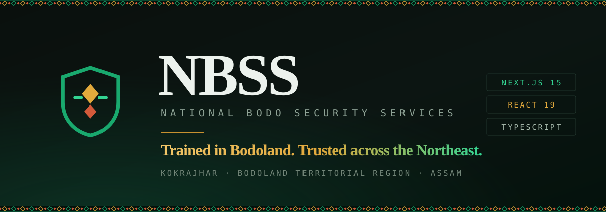

<div align="center">



<br>

**A complete marketing and operations website for a private security agency in Kokrajhar,<br>the administrative seat of the Bodoland Territorial Region, Assam.**

<br>

[](https://nextjs.org)
[](https://react.dev)
[](https://www.typescriptlang.org)
[](https://pnpm.io)

<br>

**24 pages · 9 services · 3 runtime dependencies · 0 UI libraries · 0 CDN requests**

<br>

[Quick start](#quick-start) · [What NBSS means](#what-nbss-means) · [Design](#design) · [Architecture](#architecture) · [Deploy](#deploying)

</div>

---

## Quick start

```bash
pnpm install
pnpm dev            # → http://localhost:3000
```

That is the whole setup. Fonts, images and scripts are all served from `public/`,
so the site works offline and makes no third-party request at any point.

```bash
pnpm build && pnpm start   # production build — 53 pages prerendered
pnpm check                 # typecheck + lint
```

The operations inbox lives at **`/admin`**, behind HTTP basic auth:

```
username: admin
password: nbss-kokrajhar     # change before deploying — see Configuration
```

---

## What NBSS means

**NBSS = National Bodo Security Services.** The name is three real things stacked together,
and the site is built around each of them.

<table>
<tr><td width="120"><b>Bodo</b></td>
<td>A Tibeto-Burman people, among the earliest settlers of Assam and a recognised Scheduled Tribe. Bodo is one of India's scheduled languages.</td></tr>

<tr><td><b>Bodoland</b></td>
<td>The <b>Bodoland Territorial Region (BTR)</b> — an autonomous area of roughly 9,600 km² across five districts: <b>Kokrajhar, Chirang, Baksa, Udalguri and Tamulpur</b>, governed by the Bodoland Territorial Council. Population ≈ 3.15 million (2011 census). Kokrajhar is its headquarters.</td></tr>

<tr><td><b>Security<br>Services</b></td>
<td>Private security in India is regulated under the <b>Private Security Agencies (Regulation) Act, 2005 (PSARA)</b> — a state-issued licence, valid five years, requiring a tie-up with a recognised training institute. The site does <b>not</b> assert a PSARA licence: the client's profile does not mention one, and a licence number is not something to publish on the agency's behalf. Add it to <code>site.compliance</code> once confirmed.</td></tr>
</table>

A real business by this name — **"National Bodo Security Service"** — is listed in Kokrajhar on
Jwhwlao Dwimalu Road, near Bharat Petrol Pump. That address is echoed in the site content.

The BTR is agrarian and industrially underdeveloped, which makes trained, statutory-compliant
employment genuinely scarce. That fact is the premise the entire site is written around: hire
locally, verify properly, train seriously, pay on time.

**Cultural touchstones** used in the design and imagery:

- **Aronai** — the narrow woven Bodo scarf given to honour a guest, bordered with nested
  diamonds. **This motif is the identity of the whole site.**
- **Bwisagu** — the Bodo new year festival. **Bagurumba** — the butterfly dance.
- **Manas National Park** — the region's UNESCO site, on the northern edge of the coverage map.

<sub>Sources: Wikipedia (Bodoland Territorial Region, Boro culture, Kokrajhar district), Justdial, PSARA guidance, Bodoland Tourism.</sub>

---

## Design

The **information architecture** follows the company profile supplied by the client: NBSS
supplies trained security personnel, and the catalogue is the nine kinds of site it supplies them
to. The visual language is entirely its own.

### Direction: "Bodoland field dossier"

Dark, institutional, editorial. Three ideas carry it.

**1 · The Aronai band.** The woven diamond border is redrawn as a tiling SVG and used as the
structural rule between major regions of every page — under the masthead, under each page header,
above the footer. It is also the shape inside the shield. It is drawn *from* the culture rather
than decorating *with* it, and it is the one thing a visitor should remember.

**2 · The dossier grid.** Hairline borders, numbered mono eyebrows (`01 —— WHY NBSS`), tabular
figures, generous negative space. Information looks filed, not styled.

**3 · Duotone photography.** Freely-licensed source photographs vary wildly in quality, so every
image passes through the same green-black treatment and lifts to full colour on hover.
Inconsistency becomes intent.

### Tokens

| | |
| :-- | :-- |
| **Display** | Bricolage Grotesque 700/800 |
| **Body** | Instrument Sans |
| **Mono** | JetBrains Mono — eyebrows, figures, labels |
| **Ink** | `#0A100D` near-black with a green cast |
| **Green** | `#19A96E` Bodoland green |
| **Gold** | `#E2A93C` marigold, from the Kokrajhar bloom |
| **Rust** | `#D45A3A` Aronai borderwork, used sparingly |

Each of the four divisions re-points `--accent` via `[data-accent]`, so its cards, icons and photo
duotone shift colour without a second stylesheet.

---

## What's in the box

### Pages — 10 routes, 13 generated detail pages

| Route | What it is |
| :-- | :-- |
| `/` | Hero, animated stat counters, featured services, six pillars, parade video, coverage list, gallery peek |
| `/about` | Company profile, vision & mission, six pillars, management, compliance, coverage |
| `/services` | Full catalogue and a four-step onboarding explainer |
| `/services/[slug]` | **9 pages** — detail, scope of work, who it's for, inline quote form, related services |
| `/training` | The six training areas, the verification steps, and the parade video |
| `/gallery` | 28 photographs with category filter and per-image attribution |
| `/careers` | 4 roles, terms, how to apply |
| `/careers/[id]` | **4 pages** — requirements, benefits, inline application form |
| `/contact` | Contact cards, quote form, enquiry form, 8-question FAQ, coverage |
| `/admin` | Basic-auth submissions inbox with status triage |

Plus `/api/health`, a generated `/sitemap.xml` and `/robots.txt`, and a custom 404.

### Interactions

| Feature | How it works |
| :-- | :-- |
| **Live service search** | Client component, `/` keyboard shortcut. The catalogue already ships in the route bundle, so filtering is local — no request, no debounce, no spinner. |
| **Gallery filters** | Plain `<Link>`s to a search param. Every filtered view is a real, shareable URL and the back button behaves; Next handles the transition client-side. |
| **Three forms** | Server Actions + `useActionState`. Validation failures return **every** error at once with values preserved. |
| **Admin triage** | Server Action + `revalidatePath`, so the badge and the counters re-render from the file rather than from local state that could drift. |

**The forms work with JavaScript disabled.** They are real `<form method="POST">` elements; React
progressively enhances them into in-place swaps. This is verified — a raw `curl` multipart POST
with no JS returns a fully server-rendered success page and a stored reference number.

### Content

9 services · 6 districts · 4 vacancies · 6 training areas · 6 pillars · 5 compliance
categories · 8 FAQs · 28 captioned photographs — all typed TypeScript in `src/content`. No CMS,
no database on the read path, compile-time safety, fully static rendering.

---

## Architecture

```
nbss/
├── src/
│   ├── app/
│   │   ├── layout.tsx            # shell, metadata, JSON-LD
│   │   ├── actions.ts            # "use server" — the three form actions
│   │   ├── globals.css           # the entire design system, one file
│   │   ├── fonts.css             # self-hosted woff2 subsets
│   │   ├── page.tsx              # home
│   │   ├── <route>/page.tsx      # about, services, training, …
│   │   ├── services/[slug]/      # 9 prerendered detail pages
│   │   ├── careers/[id]/         # 8 prerendered vacancy pages
│   │   ├── admin/page.tsx        # operations inbox (force-dynamic)
│   │   ├── sitemap.ts · robots.ts
│   │   └── api/health/route.ts
│   ├── components/
│   │   ├── Header.tsx · Footer.tsx · Icon.tsx · Counter.tsx
│   │   ├── blocks.tsx            # shared page furniture
│   │   ├── SiteSearch.tsx        # client-side catalogue search
│   │   └── forms/                # FormContext + fields + 3 forms
│   ├── content/                  # all editorial content, typed
│   │   ├── site.ts · services.ts · gallery.ts
│   ├── lib/
│   │   ├── store.ts              # JSON-backed submissions store
│   │   └── validate.ts           # chainable validator
│   └── middleware.ts             # basic auth in front of /admin
└── public/
    ├── img/                      # 33 images
    └── fonts/                    # self-hosted woff2
```

### Decisions worth knowing

**Why no database.** Write volume for a regional agency is a handful of enquiries a day. A JSON
file behind an in-process mutex, written via temp-file-and-atomic-rename, is the right amount of
database: no driver, no migration, and the operator can read it with `cat`. Swapping in SQLite or
Postgres later means reimplementing one module — `src/lib/store.ts`.

**Why the form fields are controlled.** React 19 resets an uncontrolled form once its action
resolves. Left alone, that wipes every select, radio and checkbox the moment validation fails.
`FormContext` holds the live values and re-seeds them from what the server echoed back, so nothing
typed is ever lost.

**Why filters are links, not state.** A filtered catalogue or gallery is something people send to
each other. Search params make each view a real URL with working history, and cost nothing —
Next still transitions client-side.

**Why a honeypot and not a CAPTCHA.** A hidden field costs nothing, catches most scripted
submitters, and does not cost conversions. Honeypot hits get a normal-looking success page and are
silently discarded — telling a bot it failed only helps it try again.

**Security.** A strict CSP (`default-src 'self'`) is possible precisely because nothing loads from
a CDN. Plus `nosniff`, `X-Frame-Options: DENY`, a referrer policy, a permissions policy,
constant-time credential comparison in middleware, and server-side allow-listing of every select
and radio value — a forged `service` slug or `district` is rejected, never stored.

---

## Configuration

Create a `.env` in the project root:

| Variable | Default | |
| :-- | :-- | :-- |
| `NEXT_PUBLIC_BASE_URL` | `http://localhost:3000` | canonical links, Open Graph, sitemap |
| `NBSS_ADMIN_USER` | `admin` | operations login |
| `NBSS_ADMIN_PASS` | `nbss-kokrajhar` | **change before deploying** |
| `NBSS_DATA` | `./data/submissions.json` | where submissions are written |

---

## Deploying

**Vercel / Netlify** — push the repo and set the environment variables above. Note that a
serverless filesystem is ephemeral: point `NBSS_DATA` at a mounted volume, or swap
`src/lib/store.ts` for a hosted database.

**A normal server** — the whole app runs behind `pnpm start` on any Node 20+ host:

```ini
[Unit]
Description=NBSS website
After=network.target

[Service]
WorkingDirectory=/opt/nbss
ExecStart=/usr/bin/pnpm start -p 8080
Environment=NEXT_PUBLIC_BASE_URL=https://nbss.co.in
Environment=NBSS_ADMIN_PASS=change-me
Environment=NBSS_DATA=/var/lib/nbss/submissions.json
Restart=always
User=nbss

[Install]
WantedBy=multi-user.target
```

Put nginx or Caddy in front for TLS. The app reads `X-Forwarded-For` for the client IP it records
against each submission.

---

## Accessibility & performance

- Skip link, landmark regions, `aria-current` on the active nav item, labelled controls with
  `aria-invalid` on failure, `role="status"` and `role="alert"` on live regions.
- Focus moves to the confirmation panel after a form submits.
- Every animation sits behind `prefers-reduced-motion`. Stat counters render their final value on
  the server, so the number is correct without JavaScript and in a screen reader.
- Fonts are preloaded and self-hosted; images go through `next/image` with explicit `sizes`.
- No horizontal overflow at any width — verified from 390px up.
- **First Load JS: ~102 kB shared**, most routes ~111 kB.

---

## Content provenance

Company facts on this site come from the profile supplied by the client: the name, slogan, phone
number, registered office, vision and mission, service list, "why choose us" points, training
areas, compliance categories, management and districts served.

Where the profile is silent, the field is **absent rather than filled in**. There is no founding
year, no company timeline, no registration or licence numbers, no ISO claim, no email address, no
client names, no testimonials and no headcount or renewal statistics on the site, because none of
those have been confirmed. `src/content/site.ts` documents this at the top; add values there as
the client supplies them.

Photographs and video credited to National Bodo Security Service were supplied by the client and
are **not** Creative Commons licensed. The remaining images are CC or public domain. Full details
in **[CREDITS.md](CREDITS.md)**, and printed under each image in the gallery.

---

<div align="center">
<sub>

Built in Kokrajhar colours · <b>Aronai</b> motif drawn from the woven Bodo scarf

</sub>
</div>
